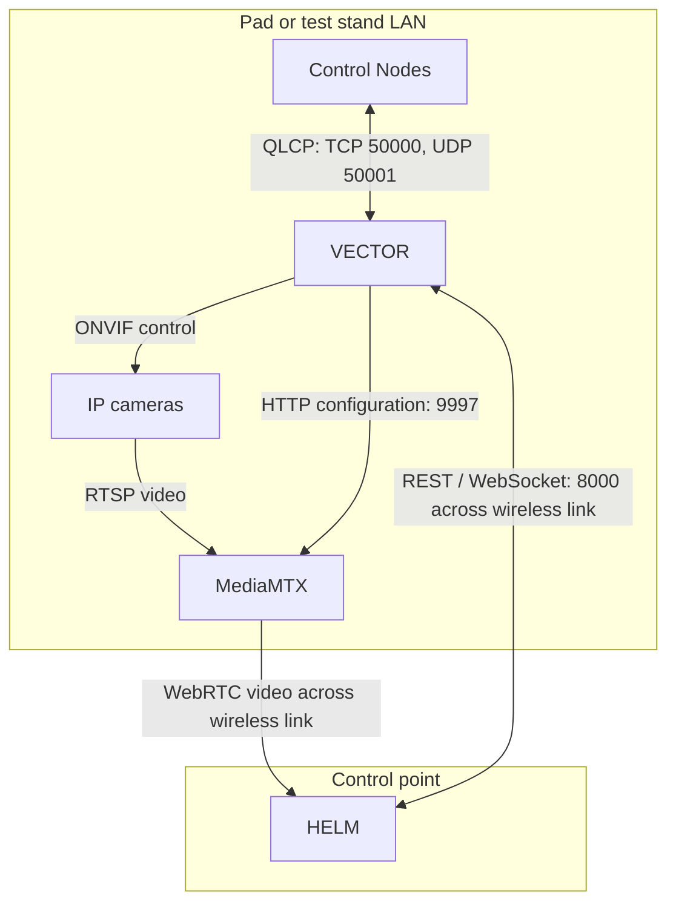

# VECTOR architecture

VECTOR is the central server for QRET's ground control system. It connects the hardware at the pad or test stand to [HELM](https://github.com/Queens-Rocket-Engineering-Team/ctl-helm), the operator GUI at the control point. This guide explains how that job is divided across the codebase and where to start when changing it. For installation and operating commands, see the [README](README.md).

## Where VECTOR fits

A **Control Node** reads sensors and operates controls, such as valves, relays, or heater setpoints. It describes its sensors and controls to VECTOR through QLCP; the node owns the hardware-specific I/O and control algorithms.

Nodes communicate with VECTOR over the pad LAN. HELM reaches VECTOR from the control point across a transparent wireless link. VECTOR sees ordinary network traffic; it has no radio-specific integration. Sensor data and control commands pass through VECTOR. Camera video travels directly from MediaMTX to the GUI.

HELM builds a Tauri desktop application for the control point and a browser version for field tablets from the same Vue frontend. The tablet build is view-only for actuators, with [limited discovery, camera, and preview-stream capabilities](docs/CLIENTS.md#client-capabilities-and-assumptions). Tablets are expected to be disconnected during armed operations; this matters to the [GUI watchdog](docs/SAFETY.md#the-gui-watchdog).

Current Control Nodes use ESP32s running [ctl-node-firmware](https://github.com/Queens-Rocket-Engineering-Team/ctl-node-firmware). VECTOR learns their sensors and controls from QLCP CONFIG, so hardware-specific definitions belong in the firmware.

## Code map

Paths below are relative to `src/vector/` unless stated otherwise.

| Area | Responsibility |
|---|---|
| [server.py](src/vector/server.py), [runtime/services.py](src/vector/runtime/services.py) | Build the shared runtime objects and manage process startup and shutdown. |
| [api/](src/vector/api/) | FastAPI routes, request validation, HTTP responses, and WebSocket entry points. Routes call runtime services. |
| [runtime/](src/vector/runtime/) | Coordinate ongoing work: connections, commands, telemetry, client streams, discovery, recording, and peripherals. A runtime owns the lifetime and behavior of its subsystem. |
| [drivers/](src/vector/drivers/) | Low-level operations on one device: ESP socket framing or camera ONVIF calls. |
| [state/](src/vector/state/) | Build the shared view of devices, controls, commands, tares, and the active recording that clients consume. |
| [qlcp/](src/vector/qlcp/) | Python packet types, CONFIG parsing, and calls into the C protocol library. |
| [integrations/](src/vector/integrations/) | The HTTP client for MediaMTX's configuration API. |
| [daemons/](src/vector/daemons/) | The interactive terminal interface, which calls the same runtime objects as the API. |
| [config.py](src/vector/config.py) | Load service and camera settings from YAML. Nodes supply their own sensor/control CONFIG. |
| [tests/](tests/) | Unit tests and socket-based node simulators, including integration tests. |
| [ctl-qlcp-lib/](https://github.com/Queens-Rocket-Engineering-Team/ctl-qlcp-lib/tree/3f37353920a323ef7feba61f3b0745106bce5ddf), [hatch_build.py](hatch_build.py) | The pinned C protocol implementation and the build hook that exposes it to Python. |

## Process and state ownership

`python -m vector` enters `server.main()`, loads `PROP_CONFIG` (default `./config.yaml`), and calls `build_runtime()`. That function constructs one `RuntimeServices` object containing the connected services and checks that the recordings directory is writable. FastAPI, the CLI, listeners, and runtime tasks then run on the same asyncio event loop. Blocking audio work and archive generation use threads.

The shared loop is an architectural assumption. For example, recording attaches its CSV writer without an `await`, so telemetry cannot arrive halfway through that operation. QLCP decoding also reuses buffers under this single-thread assumption. Moving work into another thread or process requires revisiting those boundaries.

State has several owners: the ESP runtime owns live connections, `CommandTracker` owns command lifecycles, and `SessionRuntime` owns the active recording. `SystemState` projects these into a client-facing view and owns tare offsets itself. It retains disconnected device descriptions, while the live registry removes their connections. Most state is in memory; restarting loses tares and command history. Completed recordings live on disk.

On shutdown, the server cancels its API and CLI tasks, attempts to finalize the recording, cancels runtime tasks, and closes device resources. Log streaming stops last. Runtime tasks are created directly; there is no service supervisor that restarts failed tasks inside the process.

## Subsystem reference

| Topic | Start here |
|---|---|
| Device discovery, connection lifetime, commands, and responses | [Control Nodes](docs/NODES.md) |
| Sensor data, taring, timestamps, and display downsampling | [Telemetry](docs/TELEMETRY.md) |
| REST, state snapshots/events, WebSockets, and diagnostics | [Client interface](docs/CLIENTS.md) |
| Recording sessions, cameras, audio, and older integrations | [Recording and media](docs/RECORDING.md) |
| Shared protocol implementation, native build, and versioning | [QLCP bindings](docs/QLCP.md) |
| Hardware defaults, node watchdogs, and loss of GUI control | [Safety](docs/SAFETY.md) |

When adding behavior, put orchestration in a runtime, device I/O in a driver or integration, and client input/output in the API. Wire new shared services through `build_runtime()`. The subsystem pages identify the tests and contracts that usually change alongside each path.
