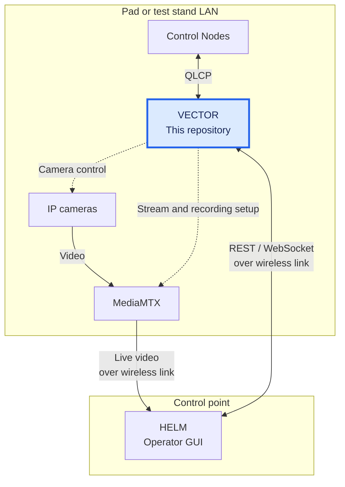

# VECTOR

VECTOR (Vehicle Event, Control, Telemetry, and Operations Router) is the central server for QRET's propulsion ground control system. It connects control nodes to [HELM](https://github.com/Queens-Rocket-Engineering-Team/ctl-helm), collects telemetry, sends control commands, and records tests with camera video and metadata.

VECTOR runs on Linux on the pad or test-stand LAN. HELM runs at the control point and reaches it over long-range a wireless link. Nodes communicate with VECTOR using QLCP; HELM uses REST and WebSockets. Camera video reaches HELM through MediaMTX.



## Architecture and reference

Start with [ARCHITECTURE.md](ARCHITECTURE.md) for the deployment diagram, code map, process lifecycle, and state ownership. The subsystem guides explain the main flows, design decisions, and relevant source files:

| Subsystem | Reference |
|---|---|
| Nodes and commands | [Discovery, connection lifetime, response tracking](docs/NODES.md) |
| Telemetry | [Ingest, timestamps, taring, display downsampling](docs/TELEMETRY.md) |
| HELM and other clients | [REST, WebSocket state, client capabilities](docs/CLIENTS.md) |
| Recording and media | [Sessions, CSV, cameras, audio](docs/RECORDING.md) |
| QLCP | [Shared C library, CFFI build, versioning](docs/QLCP.md) |
| Safety | [Hardware defaults, node watchdogs, loss of GUI control](docs/SAFETY.md) |

The node firmware lives in [ctl-node-firmware](https://github.com/Queens-Rocket-Engineering-Team/ctl-node-firmware). Packet definitions live in the pinned [QLCP specification](https://github.com/Queens-Rocket-Engineering-Team/ctl-qlcp-lib/blob/3f37353920a323ef7feba61f3b0745106bce5ddf/PROTOCOL_SPECIFICATION.md).

## Development

From a checkout, initialize the protocol submodule:

```bash
git submodule update --init --recursive
```

Edit [config.yaml](config.yaml) for your service addresses and cameras. For a simulator-only setup, use `cameras: []`. Nodes supply their sensor/control descriptions when they connect; those definitions do not go in this file.

### Run with Docker

The development stack builds VECTOR locally and starts MediaMTX, Mumble, and HELM's tablet web build. It uses host networking for node discovery and device traffic.

```bash
mkdir -p recordings
docker compose -f compose.dev.yml up --build --watch
```

[Compose Watch](https://docs.docker.com/compose/how-tos/file-watch/) enables the rules in [compose.dev.yml](compose.dev.yml): source/config changes restart the server; dependency and protocol changes rebuild it. Omit `--watch` for a normal run. To follow just the server's logs:

```bash
docker compose -f compose.dev.yml logs -f server
```

The server and MediaMTX run as UID/GID `1000:1000` by default. Set `DOCKER_UID` and `DOCKER_GID` in `.env` to match your user, and make `recordings/` writable by that user. See [recording storage](docs/RECORDING.md#storage-and-deployment) for the shared mount and ownership details.

### Run from source

Install Python 3.12+, [uv](https://docs.astral.sh/uv/), Git, GCC, CMake, and make. The audio integration also needs the system Opus library; recording audio uses ffmpeg.

```bash
uv sync
uv run -m vector
```

Installation builds the native QLCP library and Python extension. After changing the protocol library, rebuild with `uv sync --reinstall-package vector`; see [QLCP bindings](docs/QLCP.md#what-installation-builds).

The local process starts VECTOR only. MediaMTX and Mumble are separate services configured in YAML. VS Code users can install the repository's recommended extensions and select the `.venv` interpreter.

### Work without hardware

With VECTOR running, start a simulated node in another terminal:

```bash
uv run -m tests.mock_device --server 127.0.0.1
```

In VECTOR's interactive terminal, use `list` to check registration and `stream MockDevice 30` to request readings. `help` lists the other commands. HELM can connect to the same server for testing its displays and controls.

For GPS/flight-display work, use `uv run -m tests.chimera_mock_device --server 127.0.0.1`. Omit `--server` from either simulator to exercise multicast discovery.

Run the Python test suite with:

```bash
uv run pytest
```

The subsystem guides link to focused tests. Socket integration tests use simulated nodes; they do not require physical hardware.

## Configuration and deployment

VECTOR reads `./config.yaml` by default. `PROP_CONFIG` selects another path, and `PROP_LOG_LEVEL` sets stdout verbosity.

| YAML setting | Purpose |
|---|---|
| `accounts.camera` | Camera credentials for ONVIF |
| `cameras` | Camera IP addresses and ONVIF ports |
| `services.mediamtx` | MediaMTX host and configuration API port |
| `services.mumble` | Voice server connection and temporary audio directory |
| `services.recordings` | VECTOR and MediaMTX paths to the same recordings directory |

The Compose stack exposes these services:

| Service | Role |
|---|---|
| `server` | VECTOR API on `8000`; QLCP TCP on `50000`, UDP telemetry on `50001`, multicast discovery at `239.100.0.1:10000` |
| `media` | Camera relay/recorder; configuration API on `9997`, WebRTC signaling on `8889` |
| `gui` | Static HELM tablet build on `8080`; the browser connects directly to VECTOR and MediaMTX |
| `mumble` | Voice server on `64738` for the retained audio integration |

The tablet build has [limited command capabilities](docs/CLIENTS.md#client-capabilities-and-assumptions). It is separate from HELM's desktop application at the control point.

For deployment, set `IMAGE_TAG` and `GUI_TAG` in `.env` to published image tags tested together, then run:

```bash
docker compose -f compose.prod.yml up -d
```

[compose.prod.yml](compose.prod.yml) currently uses the older image names `prop-teststand-server` and `prop-new-control-gui-web`, under `ghcr.io/queens-rocket-engineering-team/`. If unset, `IMAGE_TAG` defaults to `latest` and `GUI_TAG` to `v1.0.0`. MediaMTX is pinned to `1.20.0`; its [recording compatibility requirement](docs/RECORDING.md#cameras-and-mediamtx) matters when changing that version.

## Using VECTOR

Point HELM at the server's IP. The API reference is available at `/docs` on port `8000`; `/v1/state` gives a snapshot and `/v1/metrics` exposes diagnostics. The local CLI also supports discovery, streaming, controls, taring, and ESTOP.

Tares are applied on the server so all clients see the same zeroed readings. They survive node reconnects and are cleared on server restart. See [telemetry](docs/TELEMETRY.md#taring) for sample capture and name matching.

Recording sessions collect telemetry, available video/audio, and `session.json` into one directory. VECTOR's recordings are the default source for analysis; HELM also keeps a CSV backup at the control point. HELM coordinates acquisition and recording; calling `POST /v1/sessions/start` directly starts recording without changing node stream rates. Stop with `POST /v1/sessions/stop`, then download through the session API. See [recording and media](docs/RECORDING.md) for endpoints, formats, and retention.

VECTOR's GUI watchdog attempts ESTOP after ten minutes with no `/ws/state` clients, including after a boot where no GUI connects. Any state client counts, including a tablet, so field tablets are expected to be disconnected during armed operations. Read the [safety guide](docs/SAFETY.md) for the node watchdogs, hardware defaults, and meaning of a successful command send.
