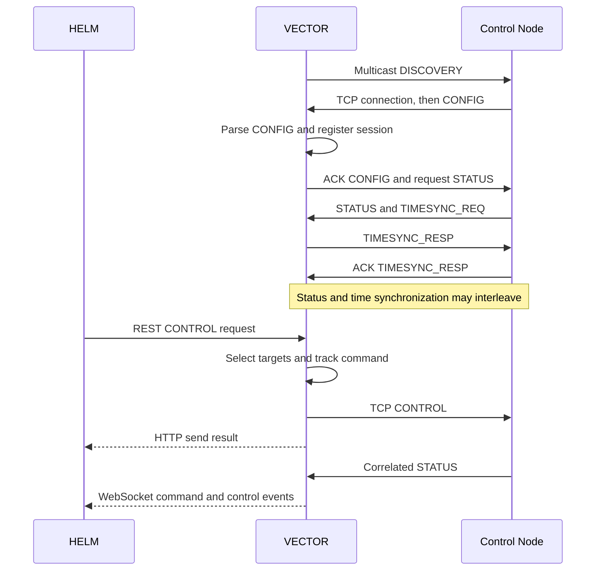

# Control Nodes

[Architecture overview](../ARCHITECTURE.md) · [Shared core](CORE.md) · [QLCP bindings](QLCP.md) · [Safety](SAFETY.md)

The ESP connection runtime turns a TCP socket into a known device that other parts of VECTOR can command. It owns registration, replacement, command sends, response handling, and cleanup. Sensor DATA takes the separate [UDP telemetry path](TELEMETRY.md).

## Ownership

| Component | Job |
|---|---|
| [DiscoveryService](../src/vector/runtime/discovery.py) | Announce the server using QLCP multicast discovery. |
| [ESPConnectionRuntime / ESPDeviceSession](../src/vector/runtime/esp_connection_runtime.py) | Coordinate all devices; hold one connection's CONFIG, sync status, monitor task, and heartbeat task. |
| [ESPDriver](../src/vector/drivers/esp.py) | Read and write bytes, recover packet framing, and call the QLCP codec. |
| [DeviceRegistry](../src/vector/runtime/device_registry.py) | Find the current session for an IP address. |
| [CommandTracker](../src/vector/runtime/command_tracker.py) | Match responses to sends and retain pending/recent command records. |
| [QLCPStateAdapter](../src/vector/runtime/qlcp_state.py) | Translate CONFIG definitions and feedback into the core; project tracker commands and transport health into client state. |

## From discovery to a configured node

VECTOR multicasts DISCOVERY to `239.100.0.1:10000`, by default every 30 seconds. A disconnected node learns the server address from that packet and opens TCP to server port `50000`. This is QLCP discovery; older SSDP names in comments refer to the previous implementation.

Each accepted socket gets its own handshake task and a ten-second deadline for the first CONFIG packet. A node that stalls cannot block other registrations. Invalid JSON, an invalid device description, or a different first packet closes that socket.

CONFIG describes the device name, sensor groups, and control groups, types, units, and defaults. Numeric sensor/control IDs come from JSON member order, so that order must survive parsing. The server interprets IDs using the CONFIG for this connection; they are not permanent hardware identifiers. GPIO mappings and control algorithms belong to the firmware.

Registration also creates a core source under `("qlcp", device_name)` and retains its handle on the session. After registration, VECTOR starts the session's monitor and heartbeat tasks, acknowledges CONFIG, and requests the initial control states. Time synchronization is initiated by the node. VECTOR marks the session synchronized after the corresponding TIMESYNC_RESP acknowledgement.

## Names and identity

Sensor and control names identify physical objects and normally come from the P&ID (piping and instrumentation diagram); internal items such as board relays use implementation-specific names. Control names must be unique within a node, ignoring case: VECTOR rejects a CONFIG that repeats one and does not register the node. A control is identified by its node and name, so the same control name on two nodes is two distinct controls. VECTOR logs a warning in that case because recording control columns are keyed by name alone.

Sensor names are shared across nodes on purpose: [tares](TELEMETRY.md#taring) apply by sensor name and recording columns use these names, so the same sensor name on more than one node must represent the same physical measurement. The existing command endpoint still targets a control name across every node declaring it; see [Sending a command](#sending-a-command).

## Sending a command

The [device routes](../src/vector/api/routers/devices.py) translate a REST request into runtime calls. `STREAM`, `STOP`, and `GETS` target all registered nodes. `CONTROL` targets every node declaring the requested control name, using a case-insensitive lookup. There is no device selector in that REST request, so duplicate control names cause fan-out. The [CLI](../src/vector/daemons/cli_terminal.py) can target a named device through the same runtime operations.

The API or CLI parses operator input into a typed core value. The core validates each selected binding and dispatches to its QLCP handler, which creates a packet and registers it with `CommandTracker` before sending. A value that does not fit the control's wire type is refused there without affecting the connection. OPEN/CLOSED are converted to and from core booleans at this boundary. The tracker matches a response using `(connection_key, packet_type, sequence)`. The per-connection key matters because packet sequence numbers wrap and a reconnected node must not complete commands from its previous session.

An HTTP `sent` result reports a successful send. Response processing happens separately and publishes client events; HTTP and WebSocket delivery can interleave. QLCP v3.1 answers CONTROL with STATUS; VECTOR uses its correlation fields to mark the command `acked`, then applies each reported control state. A STATUS can report `confirmed`, `pending`, or `error`; on error the last known value is retained with the error status. An unsolicited STATUS updates controls without completing a command.

The tracker calls its response policy `ack_expected`, although CONTROL normally completes through STATUS. Commands such as ESTOP and GET_SINGLE have terminal `sent` records: VECTOR does not wait for their STATUS or DATA response to complete those records. See the [client interface](CLIENTS.md#command-results-and-control-state) for the public meaning of these fields.

## Disconnects and replacement

There is one live session per IP, and a newly registered device with an existing name replaces the old connection even if its IP changed. The registry uses IPs for UDP attribution; state identifies these sources by provider `qlcp` and key equal to the device name; command matching uses connection keys. A deployment must preserve distinct node source IPs and intentional device names.

Heartbeats are sent every five seconds. The heartbeat loop also expires commands older than ten seconds, so expiry is checked on that loop's schedule. Three consecutive expired heartbeat responses remove the session; a matched heartbeat ACK resets the miss count. Read failures, socket closure, and failed operator-command sends also remove it.

Cleanup closes the socket, cancels session tasks, fails pending commands as `timed_out`, and closes the source handle. The core retains its description for client display and recording schemas; `SystemState` publishes the existing disconnect event. Connection-key and source-handle checks prevent cleanup or feedback from an old session from affecting its replacement. The node's own five-minute watchdog is a separate [safety layer](SAFETY.md).

## Changing this subsystem

Keep framing changes in `ESPDriver`, session behavior in `ESPConnectionRuntime`, and response-correlation policy in `CommandTracker`. A new packet type also touches the [protocol wrappers](QLCP.md).

Start with [runtime tests](../tests/unit/test_esp_connection_runtime.py), [listener tests](../tests/unit/test_esp_connection_listener.py), and [command tracker tests](../tests/unit/test_command_tracker.py). The [mock-device integration tests](../tests/integration/test_mock_device_integration.py) exercise real TCP/UDP connections, CONFIG, CONTROL/STATUS, and telemetry without physical hardware.
