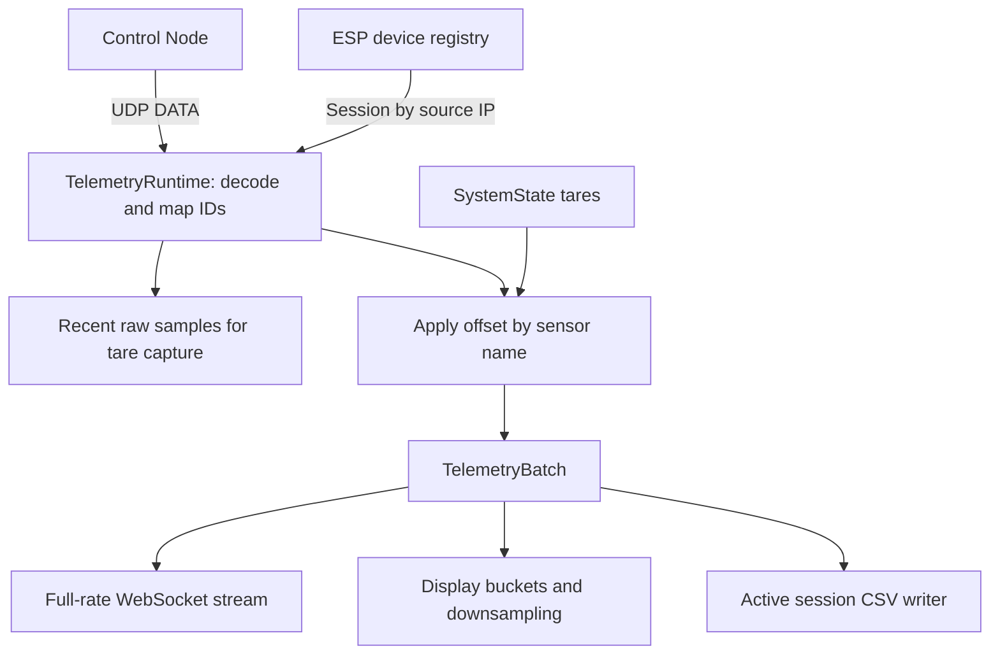

# Telemetry

[Architecture overview](../ARCHITECTURE.md) · [Client interface](CLIENTS.md) · [Recording](RECORDING.md)

Telemetry is the stream of sensor readings from the nodes. [TelemetryRuntime](../src/vector/runtime/telemetry_ingest.py) receives DATA packets on UDP port `50001`, maps their IDs to sensor descriptions, applies tare offsets, and passes each batch to its consumers.

## The data path

A DATA datagram contains sensor IDs and values; the corresponding TCP session supplies their names, groups, and units. Attribution uses the datagram's **source IP**, so the node must already be registered and reachable under that same address. Unknown senders, invalid packets, and non-DATA UDP packets are discarded. An unknown sensor ID is skipped while valid readings in that packet continue.

The resulting `TelemetryBatch` contains the device name, address, connection key, timestamp, and mapped readings. It is an internal Python type, not the WebSocket wire format. `build_runtime()` wires three publishers into ingest: [full-rate telemetry](../src/vector/runtime/telemetry_stream.py), [display telemetry](../src/vector/runtime/telemetry_display_stream.py), and the [session publisher](../src/vector/runtime/session_telemetry.py). The last is always present and becomes a no-op when no recording is active.

Publishers are called synchronously on the event loop. WebSocket publishers queue their output; the recorder performs buffered CSV writes. The UDP listener limits the datagrams processed per turn, then yields so commands and other tasks can run. Adding a publisher therefore adds work directly to ingest: it must return promptly.

## Clocks

QLCP uses microsecond timestamps. Once the node has acknowledged time synchronization, VECTOR uses the device timestamp in the server's monotonic timebase, converted to seconds. Before that, it uses the server's receive time. Full-rate messages expose `timestamp_source` and `timestamp_synced` so consumers can tell the difference.

Monotonic time measures elapsed time and is not a calendar date. It is used for telemetry, command timing, and timeouts. Recordings save both monotonic and Unix start times so telemetry can be aligned with wall-clock video filenames; see [recording time alignment](RECORDING.md#timestamps-and-recorded-values).

UDP favors timely readings over reliable delivery. Neither the full-rate WebSocket nor a CSV can recover a datagram that never reached VECTOR.

## Taring

A **tare** is an offset subtracted from a sensor's reading to zero it. Ingest keeps a bounded history of raw readings per `(device_name, sensor_name)`. The [tare API](../src/vector/api/routers/tares.py) averages recent samples and rejects stale buffers. If multiple devices are recently reporting that name, the caller must identify which device to sample.

The resulting offset is stored in `SystemState` by sensor name and applies to every device reporting that name, following the [equipment naming convention](NODES.md#names-and-identity). This keeps all clients consistent and lets a tare survive a node reconnect. Offsets are held in memory and disappear when VECTOR restarts. Re-taring uses raw samples, so offsets do not accumulate.

The `/ws/telemetry/raw` stream is full rate, but its `value` is already tared. It includes the offset as `tare`, allowing recovery of the original reading as `value + tare`. Display points and session CSV sensor values are also tared, but do not include a per-reading offset.

HELM displays these already-tared values in both desktop and tablet builds. Its [state consumer](https://github.com/Queens-Rocket-Engineering-Team/ctl-helm/blob/5ad1943c4b32c5b5fb1a8a9a2b2c53af0fd7c9a1/src/composables/useStateStream.js) uses `tares` to show which sensors are zeroed; clients must not subtract the offset again.

## Display and buffering

The display publisher groups readings into approximately 33 ms buckets per device connection. At each boundary it reduces each sensor's samples to a small point set, targeting eight points per bucket. Clients choose M4 or decimation; M4 is the default. A periodic task flushes the trailing bucket when input pauses. The rate of display updates is independent of the node's acquisition rate.

Both telemetry sockets have independent, bounded queues per client. When a queue fills, its oldest batch is dropped so a slow viewer cannot block ingest. These drops are counted in metrics but are not announced in the stream. Use the [recording path](RECORDING.md) for server-side capture; the display stream is intended for live plots.

## Changing this subsystem

Sensor mapping, timestamp selection, and tare application belong in `TelemetryRuntime`. Add consumers through its publisher interface and the composition in `build_runtime()`. Keep client serialization in the stream classes.

Relevant tests cover [ingest and tare capture](../tests/unit/test_telemetry_ingest.py), [UDP reception](../tests/unit/test_telemetry_udp_listener.py), [display bucketing](../tests/unit/test_telemetry_display_stream.py), and [raw-stream backpressure](../tests/unit/test_telemetry_stream.py). The [integration tests](../tests/integration/test_mock_device_integration.py) also check that applying a tare preserves the recoverable raw reading.
